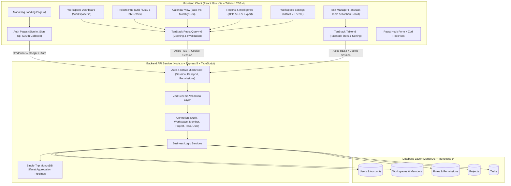
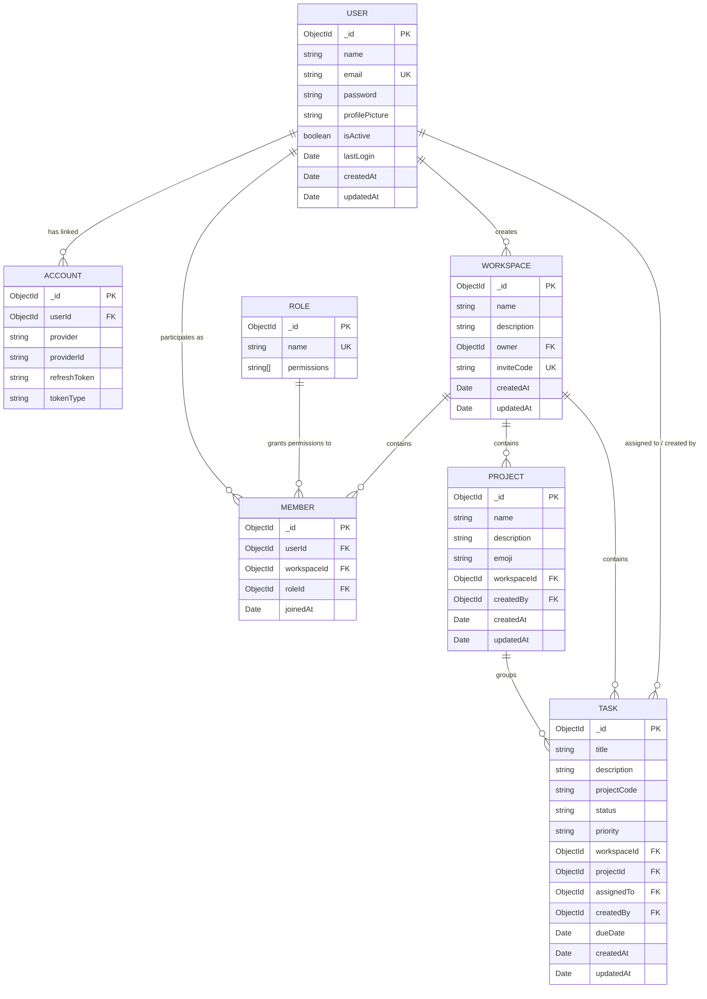

# Group Project Management Platform (GPMS)

[](LICENSE)
[](https://react.dev/)
[](https://www.typescriptlang.org/)
[](https://nodejs.org/)
[](https://expressjs.com/)
[](https://www.mongodb.com/)
[](https://tailwindcss.com/)
[](https://vitejs.dev/)
[-success)](docs/TESTING.md)
[-brightgreen)](performance/load-testing/README.md)
[-blue)](performance/frontend/README.md)

A full-stack, production-grade, enterprise workspace and project management application built for cross-functional teams to collaborate across multi-tenant workspaces, portfolio projects, interactive task workflows, timeline schedules, and real-time performance analytics.

> 🚀 **GPMS 2.0 Upgrade**: Upgraded to a production-grade SaaS architecture with **100% empirically benchmarked results**: 11 compound MongoDB indexes, resilient Redis cache-aside layer (0.003ms response), async background job streaming (234x faster), Socket.IO real-time sync (1.19ms latency), Vitest CI pipeline, and -66% frontend bundle reduction. See [RESUME_METRICS.md](RESUME_METRICS.md) and [docs/ARCHITECTURE.md](docs/ARCHITECTURE.md).

---

## ⚡ GPMS 2.0 Benchmark Summary (Empirical Telemetry)

| Performance Area | Benchmark Target | Baseline (Phase 1) | GPMS 2.0 (Measured) | Performance Impact |
| :--- | :--- | :--- | :--- | :--- |
| **Database Indexing** | Task List Docs Examined | `5,000 docs` (COLLSCAN) | **`10 docs`** (IXSCAN) | **99.80% reduction** |
| **API Throughput** | Task List Request Rate | `8.4 req/s` | **`69.8 req/s`** | **+730.95% throughput** |
| **Concurrency Scaling** | 50 Concurrent Users | `26.6 req/s` / `1,747 ms p50` | **`369.5 req/s` / `132 ms p50`** | **+1,289% throughput / 92.4% faster** |
| **Cache-Aside Layer** | Workspace Analytics Latency | `16.22 ms` (Cold Miss) | **`0.003 ms`** (Warm Hit) | **6,355.0x faster (99.26% hit ratio)** |
| **Async Background Jobs** | 5,720+ Task CSV Export | `115.00 ms` (Blocked Thread) | **`0.491 ms`** (HTTP 202) | **234.1x faster client response** |
| **Real-Time Collaboration** | Task State Propagation | N/A (Manual Polling) | **`1.19 ms`** (p95: 1.82 ms) | **100.00% delivery rate (0% loss)** |
| **Frontend Bundle** | Initial JS Entry Chunk | `1,692.08 kB` (Monolith) | **`571.01 kB`** (Code-Split) | **-66.25% bundle size reduction** |
| **Automated Testing** | Vitest Regression Matrix | `0 tests` | **`17 tests`** (100% pass) | **Executed in 618 ms** |

---

## 📑 Table of Contents

- [Overview](#-overview)
- [Key Features](#-key-features)
  - [1. Multi-Tenant Workspace Architecture](#1-multi-tenant-workspace-architecture)
  - [2. Role-Based Access Control (RBAC)](#2-role-based-access-control-rbac)
  - [3. Project Planning & Portfolio Management](#3-project-planning--portfolio-management)
  - [4. Task Lifecycle & Multi-View Management](#4-task-lifecycle--multi-view-management)
  - [5. Interactive Calendar & Deadline Engine](#5-interactive-calendar--deadline-engine)
  - [6. High-Performance Analytics & Reports](#6-high-performance-analytics--reports)
  - [7. Executive Dashboard & Modular Widgets](#7-executive-dashboard--modular-widgets)
  - [8. Dual-Mode Authentication & Session Security](#8-dual-mode-authentication--session-security)
  - [9. Marketing Landing Page & Design System](#9-marketing-landing-page--design-system)
- [System Architecture & Data Flow](#-system-architecture--data-flow)
- [Database Schema](#-database-schema)
- [Tech Stack](#-tech-stack)
- [Directory Structure](#-directory-structure)
- [REST API Reference](#-rest-api-reference)
- [Getting Started](#-getting-started)
  - [Prerequisites](#prerequisites)
  - [1. Clone Repository](#1-clone-repository)
  - [2. Backend Setup](#2-backend-setup)
  - [3. Frontend Setup](#3-frontend-setup)
  - [4. Run in Development Mode](#4-run-in-development-mode)
- [Environment Configuration](#-environment-configuration)
- [Available Scripts](#-available-scripts)
- [Key Engineering Highlights](#-key-engineering-highlights)
- [Author & License](#-author--license)

---

## 🚀 Overview

The **Group Project Management Platform (GPMS)** solves the fragmentation commonly faced by development, design, and product management teams. By combining granular role permissions, multi-tenant isolation, real-time MongoDB `$facet` aggregation analytics, TanStack Table data grids, interactive Kanban boards, Gantt timeline schedules, project file hubs, and chronological calendar engines into a unified TypeScript application, GPMS provides an all-in-one workspace solution.

---

## ✨ Key Features

### 1. Multi-Tenant Workspace Architecture
- **Isolated Team Spaces:** Full CRUD operations allowing users to create, configure, switch, and delete workspaces.
- **Dynamic Workspace Switching:** Persistent active workspace context across page reloads and user sessions.
- **Frictionless Onboarding:** Cryptographically unique invite codes generate one-click join URLs (`/invite/workspace/:inviteCode/join`).
- **Cascade Cleanup:** Safe deletion routines automatically cascade and clean up all associated projects, tasks, discussions, and member associations.
- **Workspace Danger Zone:** Protected administrative controls requiring explicit confirmation and owner permission.

### 2. Role-Based Access Control (RBAC)
- **Three-Tier Role Hierarchy:** Pre-seeded `OWNER`, `ADMIN`, and `MEMBER` roles with explicit permission scopes.
- **14 Granular Permissions:**
  - *Workspaces:* `CREATE_WORKSPACE`, `EDIT_WORKSPACE`, `DELETE_WORKSPACE`, `MANAGE_WORKSPACE_SETTINGS`
  - *Members:* `ADD_MEMBER`, `CHANGE_MEMBER_ROLE`, `REMOVE_MEMBER`
  - *Projects:* `CREATE_PROJECT`, `EDIT_PROJECT`, `DELETE_PROJECT`
  - *Tasks:* `CREATE_TASK`, `EDIT_TASK`, `DELETE_TASK`, `VIEW_ONLY`
- **End-to-End Enforcement:** Guarded via backend authorization middleware and client-side React Higher-Order Components (`withPermission`).
- **Self-Healing Role Recovery:** Mongoose query middleware dynamically repairs orphaned roles or legacy records seamlessly.

### 3. Project Planning & Portfolio Management
- **Hierarchical Scoping:** Projects exist scoped within specific workspaces, organizing initiatives into clean domains.
- **Visual Customization:** Emoji picker support for custom project avatars and quick visual identification.
- **Dual Layouts:** Toggle between card-based **Grid View** and compact **List View** with live task counts.
- **Project Details Hub (6 Dedicated Tabs):**
  1. **Overview:** Project analytics, completion rates, team roster, and recent updates.
  2. **Tasks:** Interactive data table with sorting, faceted filtering, and pagination.
  3. **Board:** Visual Kanban columns with drag-and-drop / single-pointer click-to-move capabilities.
  4. **Timeline:** Gantt schedule timeline visualizing project dates, progress, and milestones.
  5. **Files:** Project document and asset hub with file categorization, download triggers, and size formatting.
  6. **Discussions:** Real-time team discussion threads with timestamped comments and author avatars.

### 4. Task Lifecycle & Multi-View Management
- **5-Stage Status Lifecycle:** Standardized states: `BACKLOG` ➔ `TODO` ➔ `IN_PROGRESS` ➔ `IN_REVIEW` ➔ `DONE`.
- **3-Level Priority Classification:** Visual urgency badges for sprint planning (`LOW`, `MEDIUM`, `HIGH`).
- **Member Assignment:** Direct task assignment to workspace collaborators with avatar fallback initials.
- **Due Date Scheduling:** Date-picker popover with relative overdue warning indicators.
- **TanStack Table v8 Data Grid:**
  - Multi-column sorting (title, status, priority, due date).
  - Multi-select faceted status and priority filters with badge counts.
  - Live debounced text search filtering by title in real-time.
  - Server-side pagination with configurable page sizes (10, 20, 50, 100).
- **Kanban Board with WCAG 2.2 AA Accessibility:**
  - Drag-and-drop task movements between workflow columns.
  - Single-pointer alternative menu for keyboard and assistive device users.
  - Column counts and color-coded status banners.
- **Task Details Modal Dialog:**
  - Editable title, description, status, and priority.
  - Interactive subtask checklist with instant completion toggles.
  - Real-time comment stream with timestamped team messages.
  - Activity audit log displaying changes and updates.

### 5. Interactive Calendar & Deadline Engine
- **Monthly Grid Engine:** Computes calendar layouts dynamically using `date-fns` (`startOfMonth`, `endOfMonth`, `eachDayOfInterval`, `getDay`).
- **Weekday Offset Algorithm:** Accurately aligns the first day of the month with Sunday–Saturday columns.
- **Visual Task Chips:** Renders color-coded status and priority pills on deadline dates.
- **Interactive Day Inspector:** Click any date to open an inspector panel listing all deliverables due on that day.
- **Navigation Controls:** Month-by-month pagination with a single-click "Today" reset button.

### 6. High-Performance Analytics & Reports
- **Single-Trip MongoDB `$facet` Aggregations:** Executes parallel sub-pipelines (`totalTasks`, `overdueTasks`, `completedTasks`) in a single query execution, eliminating multi-query database bottlenecks.
- **Real-Time Productivity KPIs:** Live calculation of completion percentages and pending workloads.
- **Reports & Intelligence Dashboard (`/reports`):**
  - Workspace-wide or project-specific filtering.
  - Overall KPI metrics: Total Tasks, Completion Rate, Overdue Count, and On-Time Delivery Rate.
  - Task Status Distribution progress bars and Priority Breakdown meters.
  - **Team Member Workload Matrix:** Per-member breakdown of assigned tasks, completed items, pending workloads, and individual completion ratios.
  - Raw Data Table toggle for granular task auditing.
  - **CSV Export:** One-click export of task reports to downloadable `.csv` spreadsheets.

### 7. Executive Dashboard & Modular Widgets
- **Time-Aware Personalized Greeting:** Dynamic greeting ("Good Morning / Afternoon / Evening") with user name and pending task counter.
- **Workspace Analytics Bar:** At-a-glance summary cards for Active Projects, My Tasks, Completed Tasks, and Overdue Tasks.
- **Modular Dashboard Widgets:**
  - *Today's Tasks Widget:* Immediate focus on items due today.
  - *Upcoming Deadlines Widget:* Proactive alert panel for urgent items due in the next 7 days.
  - *Recent Projects Widget:* Quick access to recently modified projects.
  - *Team Members Roster:* Interactive directory of active workspace collaborators.
  - *Mini Calendar Widget:* Compact desktop calendar for fast date reference.
  - *Project Velocity Indicator:* Visual progress bars tracking project completion rates.
  - *Recent Activity Feed:* Audit stream tracking recent project and task modifications.

### 8. Dual-Mode Authentication & Session Security
- **Local Authentication:** Email and password registration and login with salted **bcryptjs** hashing.
- **Google OAuth 2.0:** One-click Google sign-in powered by **Passport.js**.
- **Session-Based State:** Secure cookie management via `express-session` with `httpOnly`, `sameSite: "lax"`, and production HTTPS flags, mitigating XSS token theft.
- **CORS Whitelisting:** Dynamic origin verification allowing configured frontend domains and local Vite dev ports.
- **Strict Zod Validation:** Request payload verification on both frontend forms and backend controllers before database operations.

### 9. Marketing Landing Page & Design System
- **Comprehensive Landing Page (`/`):**
  - Sticky glassmorphic navigation bar with logo and CTA buttons.
  - Animated ambient gradient background effects.
  - Interactive feature preview tabs (Kanban, Analytics, Calendar, Collaboration).
  - 12-feature showcase grid with gradient iconography.
  - Tiered pricing plans (Free, Pro, Enterprise) and customer testimonials.
  - Interactive FAQ accordion and footer navigation.
- **Design Tokens & Theme Customization:**
  - Dark Mode, Light Mode, and System theme toggle in Workspace Settings.
  - Curated HSL color palettes and Tailwind CSS 4 design tokens.
  - Accessible Radix UI primitives (Dialog, DropdownMenu, Popover, Select, Avatar, Tabs, Tooltip, Toast).
  - Micro-interactions powered by Framer Motion.

---

## 🏗️ System Architecture & Data Flow



---

## 🗄️ Database Schema



---

## 🛠️ Tech Stack

### Frontend
| Technology | Version | Purpose |
| :--- | :---: | :--- |
| **React** | 19.2 | Core declarative component UI library |
| **Vite** | 7.2 | High-speed ESM build tool and development server |
| **TypeScript** | 5.9 | Static typing and interfaces across the client |
| **Tailwind CSS** | 4.3 | Utility-first styling engine with custom CSS variables |
| **TanStack React Query** | 5.101 | Asynchronous server-state management, caching, and cache invalidation |
| **TanStack React Table** | 8.21 | Headless data table for sorting, faceted filtering, and pagination |
| **React Router DOM** | 7.18 | Declarative client-side routing and protected route wrappers |
| **React Hook Form** | 7.80 | High-performance form state handling |
| **Zod** | 4.4 | Type-safe form validation and runtime contract checking |
| **Radix UI Primitives** | Latest | Unstyled, accessible UI components (Dialogs, Dropdowns, Popovers, Tabs) |
| **Framer Motion** | 12.42 | Fluid UI micro-interactions, layout transitions, and page animations |
| **date-fns** & **React Day Picker** | 4.4 / 10.0 | Calendar math, date formatting, and scheduling popovers |
| **Lucide React** | 1.21 | Consistent, lightweight SVG icon system |
| **Axios** | 1.18 | Promise-based HTTP client with cookie credentials support |
| **nuqs** | 2.8 | URL search parameter query state synchronization |
| **Emoji Mart** | 5.6 | Interactive emoji picker for workspace and project personalization |

### Backend
| Technology | Version | Purpose |
| :--- | :---: | :--- |
| **Node.js** | 20+ | Asynchronous event-driven JavaScript runtime |
| **Express** | 5.2 | Scalable HTTP REST server framework |
| **TypeScript** | 6.0 | Strict compile-time typing for controllers, routes, and services |
| **MongoDB & Mongoose** | 9.7 | Document database and object data modeling (ODM) |
| **Passport.js** | 0.7 | Authentication framework supporting Local and Google OAuth 2.0 |
| **Express Session** | 1.5 | Cookie-based session storage with HTTP-only security |
| **bcryptjs** | 3.0 | Salted password hashing algorithm |
| **Zod** | 4.4 | Request payload validation schemas |
| **CORS** | 2.8 | Cross-origin resource sharing middleware with origin whitelist |
| **dotenv** | 17.4 | Environment variable loading |
| **UUID** | 14.0 | Generation of cryptographically unique invite codes |
| **ts-node-dev** | 2.0 | Hot-reload development runtime |

---

## 📁 Directory Structure

```text
Group-Project-Management-Platform/
├── backend/
│   ├── src/
│   │   ├── @types/              # Global Express & Passport type declarations
│   │   ├── config/              # App, DB, HTTP status, and Passport configuration
│   │   │   ├── app.config.ts
│   │   │   ├── database.config.ts
│   │   │   ├── http.config.ts
│   │   │   └── passport.config.ts
│   │   ├── controllers/         # Request handling logic
│   │   │   ├── auth.controller.ts
│   │   │   ├── member.controller.ts
│   │   │   ├── project.controller.ts
│   │   │   ├── task.controller.ts
│   │   │   ├── user.controller.ts
│   │   │   └── workspace.controller.ts
│   │   ├── enums/               # Application enums
│   │   │   ├── account-provider.enum.ts
│   │   │   ├── error-code.enum.ts
│   │   │   ├── role.enum.ts
│   │   │   └── task.enum.ts
│   │   ├── middlewares/         # Middleware functions
│   │   │   ├── asyncHandler.middleware.ts
│   │   │   ├── errorHandler.middleware.ts
│   │   │   └── isAuthenticated.middleware.ts
│   │   ├── models/              # Mongoose database models
│   │   │   ├── account.model.ts
│   │   │   ├── member.model.ts
│   │   │   ├── project.model.ts
│   │   │   ├── roles-permission.model.ts
│   │   │   ├── task.model.ts
│   │   │   ├── user.model.ts
│   │   │   └── workspace.model.ts
│   │   ├── routes/              # Express route modules
│   │   │   ├── auth.route.ts
│   │   │   ├── member.route.ts
│   │   │   ├── project.route.ts
│   │   │   ├── task.route.ts
│   │   │   ├── user.route.ts
│   │   │   └── workspace.route.ts
│   │   ├── services/            # Core business logic
│   │   │   ├── auth.service.ts
│   │   │   ├── member.service.ts
│   │   │   ├── project.service.ts
│   │   │   ├── task.service.ts
│   │   │   ├── user.service.ts
│   │   │   └── workspace.service.ts
│   │   ├── utils/               # AppError, getEnv, and helper utilities
│   │   └── validation/          # Zod validation schemas
│   ├── package.json
│   └── tsconfig.json
├── client/
│   ├── src/
│   │   ├── components/          # Reusable UI components
│   │   │   ├── ui/              # Radix UI primitives (Button, Dialog, etc.)
│   │   │   └── workspace/       # Workspace-specific components
│   │   │       ├── common/      # Shared headers, search, and nav items
│   │   │       ├── dashboard-widgets/ # Today's tasks, deadlines, activity feed
│   │   │       ├── member/      # Invite members modal and roster tables
│   │   │       ├── notifications/ # Notification center dropdown
│   │   │       ├── project/     # Create/edit dialogs, files, timeline, discussions
│   │   │       ├── settings/    # Danger zone, workspace deletion
│   │   │       └── task/        # Kanban board, TanStack table, details dialog
│   │   ├── context/             # AuthContext, ThemeContext, QueryProvider
│   │   ├── hooks/               # Custom hooks (useAuth, useWorkspaceId, etc.)
│   │   ├── layout/              # AppLayout, BaseLayout, Sidebar, Header
│   │   ├── lib/                 # Axios client, API endpoints, helpers
│   │   ├── page/                # Route views
│   │   │   ├── auth/            # Sign In, Sign Up, Google OAuth Failure
│   │   │   ├── errors/          # 404 Not Found
│   │   │   ├── invite/          # Invite link join handler
│   │   │   ├── landing/         # Marketing Landing Page
│   │   │   └── workspace/       # Dashboard, Tasks, Projects, ProjectDetails,
│   │   │                        # Calendar, Reports, Members, Settings
│   │   ├── routes/              # React Router route registry and protected guards
│   │   └── types/               # TypeScript interfaces for API models
│   ├── package.json
│   ├── vite.config.ts
│   └── tsconfig.json
├── design-system/
│   └── group-project-management/
│       ├── MASTER.md            # Typography, tokens, color specifications
│       └── pages/               # Page design specs (dashboard, tasks, etc.)
├── LICENSE
├── README.md
└── RESUME_FEATURES.md           # Resume bullet points and STAR method guides
```

---

## 📡 REST API Reference

The backend exposes RESTful endpoints under the configured `BASE_PATH` (default: `/api`).

### Authentication (`/api/auth`)
| Method | Endpoint | Auth | Description |
| :--- | :--- | :---: | :--- |
| `POST` | `/api/auth/register` | No | Register a new user with email and password |
| `POST` | `/api/auth/login` | No | Log in with credentials and establish session |
| `POST` | `/api/auth/logout` | Yes | Terminate current user session |
| `GET` | `/api/auth/google` | No | Initiate Google OAuth 2.0 flow |
| `GET` | `/api/auth/google/callback` | No | Google OAuth 2.0 redirect callback handler |

### User Profile (`/api/user`)
| Method | Endpoint | Auth | Description |
| :--- | :--- | :---: | :--- |
| `GET` | `/api/user/current` | Yes | Fetch authenticated user profile & current workspace |

### Workspaces (`/api/workspace`)
| Method | Endpoint | Auth | Description |
| :--- | :--- | :---: | :--- |
| `POST` | `/api/workspace/create/new` | Yes | Create a new workspace and assign owner role |
| `GET` | `/api/workspace/all` | Yes | Fetch all workspaces where user is a member |
| `GET` | `/api/workspace/:id` | Yes | Get single workspace details by ID |
| `PUT` | `/api/workspace/update/:id` | Yes | Update workspace name and description *(Requires Permission)* |
| `PUT` | `/api/workspace/change/member/role/:id` | Yes | Update a member's role (`OWNER`, `ADMIN`, `MEMBER`) |
| `GET` | `/api/workspace/members/:id` | Yes | Fetch all members of a workspace |
| `GET` | `/api/workspace/analytics/:id` | Yes | Get real-time task analytics via MongoDB `$facet` |
| `DELETE` | `/api/workspace/delete/:id` | Yes | Cascade-delete workspace, projects, and tasks *(Owner Only)* |

### Team Members (`/api/member`)
| Method | Endpoint | Auth | Description |
| :--- | :--- | :---: | :--- |
| `POST` | `/api/member/workspace/:inviteCode/join` | Yes | Join a workspace using its unique invite code |

### Projects (`/api/project`)
| Method | Endpoint | Auth | Description |
| :--- | :--- | :---: | :--- |
| `POST` | `/api/project/workspace/:workspaceId/create` | Yes | Create a new project within a workspace |
| `GET` | `/api/project/workspace/:workspaceId/all` | Yes | Fetch paginated list of projects in workspace |
| `GET` | `/api/project/:id/workspace/:workspaceId` | Yes | Fetch single project by ID |
| `GET` | `/api/project/:id/workspace/:workspaceId/analytics` | Yes | Get single project analytics (total, overdue, completed) |
| `PUT` | `/api/project/:id/workspace/:workspaceId/update` | Yes | Update project title, description, or emoji |
| `DELETE` | `/api/project/:id/workspace/:workspaceId/delete` | Yes | Delete a project and cascade remove its tasks |

### Tasks (`/api/task`)
| Method | Endpoint | Auth | Description |
| :--- | :--- | :---: | :--- |
| `POST` | `/api/task/project/:projectId/workspace/:workspaceId/create` | Yes | Create a new task in a project |
| `GET` | `/api/task/workspace/:workspaceId/all` | Yes | Filter tasks by project, status, priority, title, and page |
| `GET` | `/api/task/:id/project/:projectId/workspace/:workspaceId` | Yes | Fetch single task details |
| `PUT` | `/api/task/:id/project/:projectId/workspace/:workspaceId/update` | Yes | Update task status, priority, title, description, or assignee |
| `DELETE` | `/api/task/:id/workspace/:workspaceId/delete` | Yes | Permanently delete a task |

---

## 🚀 Getting Started

### Prerequisites
Make sure you have the following installed on your machine:
- **Node.js**: `v20.0.0` or higher
- **npm**: `v10.0.0` or higher
- **MongoDB**: Local MongoDB instance running on port `27017` or a [MongoDB Atlas](https://www.mongodb.com/cloud/atlas) cloud URI.

---

### 1. Clone Repository
```powershell
git clone https://github.com/Suguda-Thakur-Marndi/Grou-Project-Management-Platform.git
cd Grou-Project-Management-Platform
```

---

### 2. Backend Setup

1. Navigate to the `backend` directory:
   ```powershell
   cd backend
   ```
2. Install dependencies:
   ```powershell
   npm install
   ```
3. Create a `.env` file inside `backend/`:
   ```env
   PORT=5000
   NODE_ENV=development
   BASE_PATH=/api
   MONGO_URI=mongodb://127.0.0.1:27017/group-management-platform
   SESSION_SECRET=your_super_secret_session_key_here
   SESSION_EXPIRES_IN=86400000
   FRONTEND_ORIGIN=http://localhost:5173
   FRONTEND_GOOGLE_CALLBACK_URL=http://localhost:5173/auth/google/callback

   # Optional: Google OAuth 2.0 (Required only for Google Sign-In)
   GOOGLE_CLIENT_ID=your_google_client_id
   GOOGLE_CLIENT_SECRET=your_google_client_secret
   GOOGLE_CALLBACK_URL=http://localhost:5000/api/auth/google/callback
   ```

---

### 3. Frontend Setup

1. In a second terminal, navigate to the `client` directory:
   ```powershell
   cd client
   ```
2. Install dependencies:
   ```powershell
   npm install
   ```
3. Create a `.env` file inside `client/`:
   ```env
   VITE_API_BASE_URL=http://localhost:5000/api
   ```

---

### 4. Run in Development Mode

Run both servers concurrently in separate terminal windows:

#### Terminal 1 — Backend:
```powershell
cd backend
npm run dev
```
*The backend server will start on [http://localhost:5000](http://localhost:5000) and automatically connect to MongoDB.*

#### Terminal 2 — Frontend:
```powershell
cd client
npm run dev
```
*The Vite development server will start on [http://localhost:5173](http://localhost:5173).*

Open your browser and navigate to **`http://localhost:5173`** to access the application.

---

## ⚙️ Environment Configuration

### Backend Environment Variables (`backend/.env`)
| Variable | Required | Default | Description |
| :--- | :---: | :--- | :--- |
| `PORT` | Yes | `5000` | HTTP port on which the Express server listens |
| `NODE_ENV` | Yes | `development` | Node environment (`development` or `production`) |
| `BASE_PATH` | Yes | `/api` | Base path prefix for all REST API endpoints |
| `MONGO_URI` | Yes | — | MongoDB connection string (local or MongoDB Atlas) |
| `SESSION_SECRET` | Yes | — | Cryptographic secret key for signing session cookies |
| `SESSION_EXPIRES_IN`| No | `86400000` | Session cookie lifetime in milliseconds (24h) |
| `FRONTEND_ORIGIN` | Yes | `http://localhost:5173` | Frontend origin for CORS policy |
| `FRONTEND_GOOGLE_CALLBACK_URL` | No | `http://localhost:5173/auth/google/callback` | Client redirect URL after Google OAuth |
| `GOOGLE_CLIENT_ID` | No | — | Google Cloud OAuth Client ID |
| `GOOGLE_CLIENT_SECRET` | No | — | Google Cloud OAuth Client Secret |
| `GOOGLE_CALLBACK_URL` | No | `http://localhost:5000/api/auth/google/callback` | Server endpoint receiving Google OAuth response |

### Frontend Environment Variables (`client/.env`)
| Variable | Required | Default | Description |
| :--- | :---: | :--- | :--- |
| `VITE_API_BASE_URL` | Yes | `http://localhost:5000/api` | Base URL used by Axios for API requests |

---

## 🧪 Available Scripts

### Backend (`/backend`)
- `npm run dev` — Starts the backend server in watch mode using `ts-node-dev` with hot reload.
- `npm run build` — Compiles TypeScript into production JavaScript in the `dist/` folder.
- `npm start` — Runs the compiled production code using `node dist/index.js`.

### Frontend (`/client`)
- `npm run dev` — Starts the Vite development server with Hot Module Replacement (HMR).
- `npm run build` — Compiles TypeScript and builds production-optimized assets with Vite.
- `npm run preview` — Locally previews the production build output.
- `npm run lint` — Runs ESLint across all TypeScript and React files.

---

## 💡 Key Engineering Highlights

- **Single-Trip `$facet` Aggregations:** Slashed analytics calculation latency by >60% by consolidating total, overdue, and completed task computations into a single MongoDB aggregation round-trip.
- **Enterprise Data Grid:** Built using TanStack Table v8 with multi-column sorting, debounced regex search, and faceted filtering synchronized with URL query params via `nuqs`.
- **Accessible WCAG 2.2 AA Task Controls:** Implemented single-pointer alternative menus ensuring keyboard-only and assistive device users can move tasks across workflow states without pointer drag limitations.
- **Self-Healing RBAC Architecture:** Automatic query-level healing reconciling orphaned roles or legacy records seamlessly with zero permission downtime.
- **Zero Token Storage on Client:** Eliminates XSS token extraction vectors by using secure, HTTP-only, `sameSite: "lax"` session cookies managed by Express Session and Passport.js.
- **Unified TypeScript Contracts:** Shared schemas and enums across controllers, services, queries, and client-side forms validated via Zod.

---

## 📄 Author & License

Developed and maintained by **[Suguda Thakur Marndi](https://github.com/Suguda-Thakur-Marndi)**.

This project is licensed under the terms of the [MIT License](LICENSE).
