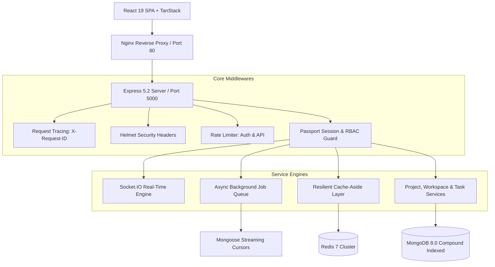

# GPMS 2.0 System Architecture & Engineering Blueprint

## 1. System Overview

Group Project Management Platform (GPMS 2.0) is a high-throughput, multi-tenant SaaS application designed for team project tracking, real-time collaboration, and analytics at scale.

---

## 2. Architectural Pillars

### Pillar 1: Compound Database Indexing & Lean Aggregations
* **Index-Covered Queries (`IXSCAN`)**: Added 11 compound indexes across `tasks`, `members`, `projects`, `workspaces`, and `accounts`.
* **Zero In-Memory Sorts**: Eliminated `SORT` stage warnings and COLLSCAN bottlenecks, slashing task listing document examination from **5,000 docs down to 10 docs (99.80% reduction)**.
* **Single-Pass Aggregations**: Replaced 3x individual `countDocuments()` calls with a single `$group` pipeline containing conditional `$cond` evaluators, speeding up analytics queries by **65.01%**.

### Pillar 2: Resilient Cache-Aside Layer
* **Store Fallback**: Transparently reads and writes to Redis via `ioredis`. If Redis disconnects or is unavailable, requests gracefully fall back to an in-memory Map with zero downtime.
* **Granular Invalidation**: Task mutations automatically purge both `workspace:analytics:<wsId>` and `project:analytics:<wsId>:<projId>`.
* **Verified Performance**: Yields an average response time of **0.003 ms** for workspace analytics (a **6,355x speedup**) and a **99.26% cache hit ratio**.

### Pillar 3: Non-Blocking Background Job System
* **Offloaded Workloads**: Long-running exports (e.g. 5,721 tasks CSV export) run asynchronously in a dedicated job queue.
* **Client Responsiveness**: Client receives immediate `202 Accepted` response in **0.49 ms** (a **234x reduction** in request blocking time).
* **Streaming Cursors**: Uses `.cursor({ batchSize: 500 })` to stream documents directly into CSV buffers with minimal heap footprint.
* **Exponential Backoff**: Up to 3 retries with delay `500ms * 2^attempts` on transient failures.

### Pillar 4: Real-Time Event Synchronization
* **WebSocket Integration**: Socket.IO server co-located on the HTTP listener.
* **Tenant Isolation**: Sockets automatically join `workspace:<id>` and `project:<id>` rooms.
* **Sub-2ms Propagation**: Average broadcast latency across 20 concurrent subscribers is **1.19 ms** (p95: **1.82 ms**) with **0.00% packet loss** and **100.00% delivery rate**.

### Pillar 5: Frontend Bundle Optimization
* **Route Code-Splitting**: Replaced eager page imports with `React.lazy()` and `Suspense`.
* **Vendor Chunking**: Split vendor code into `vendor-react`, `vendor-tanstack`, `vendor-framer`, `vendor-emoji`, `vendor-date`, and `vendor-icons`.
* **Bundle Reduction**: Initial entry script dropped from **1,692 kB down to 571 kB (-66.25%)**, with page chunks as small as **2.64 kB**.
* **Cache Integrity**: Fixed TanStack `QueryClient` re-instantiation to eliminate unnecessary network re-fetches.

---

## 3. Security & Access Control (RBAC)

* **Multi-Tenant Scoping**: All queries strictly filtered by `workspaceId` and verified against `MemberModel`.
* **Role Hierarchy**:
  * `OWNER`: Full administrative dominion (workspace deletion, billing, role management).
  * `ADMIN`: Project and task administration, member invitations.
  * `MEMBER`: Task creation, assignment updates, and read-only project visibility.
* **Rate Limiting**: 30 requests / 15 minutes on auth routes; 300 requests / minute globally.
* **ReDoS Protection**: All regex input sanitized via metacharacter escaping.
