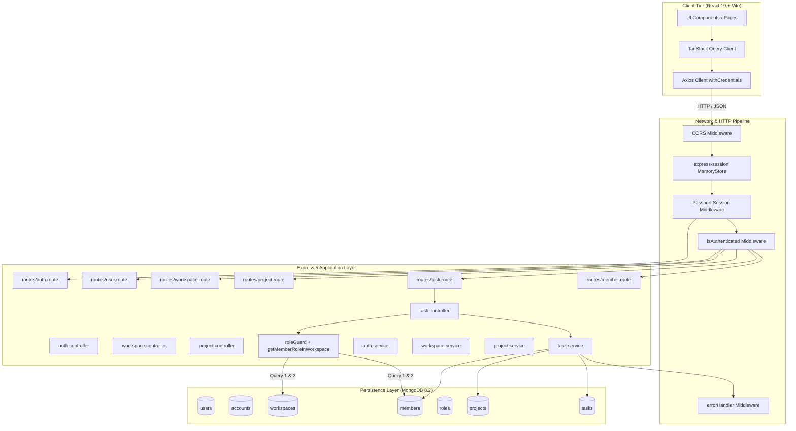

# GPMS 2.0 — Comprehensive Architecture & Engineering Audit

> **Document Version**: 1.0.0  
> **Status**: Completed  
> **Date**: September 2026  
> **Target System**: Group Project Management Platform (GPMS)  
> **Auditor**: Senior Full-Stack & Systems Performance Engineer  

---

## Executive Summary

The Group Project Management Platform (GPMS) is an ambitious full-stack multi-tenant collaboration system built with Express 5, TypeScript, Mongoose/MongoDB, React 19, and Vite. The codebase demonstrates solid functional foundations: multi-tenant workspace partitioning, an extensible role-based access control (RBAC) permission model, full CRUD capabilities for workspaces, projects, and tasks, as well as an aesthetically refined user interface featuring Kanban, timeline, calendar, and reports.

However, an in-depth code-level inspection reveals critical architectural, performance, security, and scalability bottlenecks that prevent GPMS from operating as a true production-grade SaaS system:
1. **Zero Indexing on Primary Foreign Keys & Query Paths**: Collections such as `tasks`, `members`, and `projects` lack compound or foreign key indexes, resulting in full collection scans (`COLLSCAN`) across all tenant and filter queries.
2. **N+1 & Redundant Permission Queries**: Every protected controller executes unindexed queries to verify workspace membership and role permissions, executing 2 to 3 database round trips before the actual service business logic runs.
3. **Session State In-Memory Leak**: `express-session` relies on the default `MemoryStore`, which is prone to memory leaks, prevents multi-instance horizontal scaling, and loses all active sessions upon restart.
4. **Monolithic Frontend Bundle & Cache Instability**: The Vite bundle outputs a **1.69 MB** single chunk with zero route code-splitting, while `QueryClient` is reinstantiated on every render in `QueryProvider`, wiping out client-side cache.
5. **Absence of Testing, Observability & Background Processing**: The repository contains zero automated tests (unit, integration, or E2E), zero structured logging, no health probes, and no asynchronous queue workers for heavy tasks such as CSV export or notification delivery.

This audit provides an exhaustive evaluation of the current architecture, identifies all failure modes, and establishes prioritized, actionable recommendations.

---

## 1. Current Architecture

### 1.1 Technology Stack Inventory

| Tier | Technology | Version | Purpose |
| :--- | :--- | :--- | :--- |
| **Backend Runtime** | Node.js | v20+ / Windows x64 | Application execution environment |
| **Backend Framework**| Express | ^5.2.1 | HTTP routing and middleware pipeline |
| **Language** | TypeScript | ^6.0.3 (backend) / ~5.9.3 (client) | Static type safety and compilation |
| **Database** | MongoDB Server | 8.2 Community | Primary document store |
| **ODM** | Mongoose | ^9.7.2 | Schema validation, modeling, and aggregation |
| **Authentication** | Passport.js + Express Session | 0.7.0 / 1.5.0 | Session-based cookie auth with Local & Google strategies |
| **Validation** | Zod | ^4.4.3 | Runtime schema validation for requests and entities |
| **Frontend Framework**| React | ^19.2.0 | Reactive component rendering |
| **Build Tooling** | Vite | ^7.2.4 | Dev server and Rollup production bundling |
| **Data Fetching** | TanStack Query (React Query) | ^5.101.1 | Server-state caching and synchronization |
| **Table Engine** | TanStack Table | ^8.21.3 | Headless table state management |
| **Styling** | Tailwind CSS | ^4.3.1 | Utility-first CSS engine |
| **UI Primitives** | Radix UI + Lucide Icons | Various | Accessible component primitives |

---

### 1.2 Architectural Topology



---

### 1.3 Detailed Component Breakdown

#### A. Backend Entry & Pipeline (`backend/src/index.ts`)
- **Port & Base Path**: Defaults to `5000` (configured to `8000` via `.env`), base path `/api`.
- **Session Layer**: Configured with `secret: config.SESSION_SECRET`, `saveUninitialized: false`, `resave: false`, `maxAge: 24h`, `sameSite: "lax"`.
- **Database Connection**: `connectDatabase()` invoked inside the `app.listen()` callback in `index.ts`. If the database fails to connect, Express accepts incoming requests prematurely, triggering cascading unhandled exceptions.
- **Shutdown Hooks**: Missing `SIGTERM` and `SIGINT` lifecycle listeners. Sockets and open Mongoose pools terminate abruptly on process exit.

#### B. Authentication & RBAC Engine
- **Local Authentication**: Handled via `passport-local` verifying user credentials in `verifyUserService`. Passwords hashed with `bcryptjs` (salt rounds 10) in `user.model.ts` pre-save hooks.
- **OAuth Authentication**: Google OAuth 2.0 via `passport-google-oauth20`. On success, automatically generates a default workspace (`"My Workspace"`) and binds the owner role.
- **RBAC Matrix**: Defined in `enums/role.enum.ts` (`OWNER`, `ADMIN`, `MEMBER`) and mapped in `utils/role-permission.ts`.
  - Roles are stored in a dedicated MongoDB collection (`roles`), populated by `role.seeder.ts`.
  - Authorization is verified per-controller via `roleGuard(role, [requiredPermissions])`.

#### C. Data Access & Models
- **`UserModel`**: Stores name, unique lowercase email, password hash, profile picture, and `currentWorkspace`.
- **`AccountModel`**: Links OAuth providers (`GOOGLE`, `EMAIL`) to user IDs.
- **`WorkspaceModel`**: Represents multi-tenant tenant unit; contains `name`, `description`, `owner` (ref: User), and `inviteCode` (unique).
- **`MemberModel`**: Junction collection mapping `userId` + `workspaceId` + `role` (ref: Role).
- **`ProjectModel`**: Workspace-scoped project entity with `name`, `emoji`, `description`, `workspace`, `createdBy`.
- **`TaskModel`**: Core entity containing `taskCode` (unique), `title`, `description`, `project`, `workspace`, `status`, `priority`, `assignedTo`, `createdBy`, `dueDate`.

#### D. Analytics Implementation
- **Workspace Analytics (`workspace.service.ts`)**: Executes 3 separate, sequential `TaskModel.countDocuments()` queries:
  1. Count of all tasks in workspace.
  2. Count of overdue tasks (`dueDate: { $lt: currentDate }, status: { $ne: "DONE" }`).
  3. Count of completed tasks (`status: "DONE"`).
- **Project Analytics (`project.service.ts`)**: Executes a single Mongoose aggregation using `$facet` matching `{ project: projectId }` with sub-pipelines for `totalTasks`, `overdueTasks`, and `completedTasks`.

---

## 2. Existing Strengths

1. **Strict Type Safety with TypeScript & Zod**: Every API route validates input parameters, query strings, and request bodies using Zod schemas (`auth.validation.ts`, `task.validation.ts`, `workspace.validation.ts`, `project.validation.ts`).
2. **Clean Domain Separation**: Separation of concerns is respected with dedicated directories for `routes`, `controllers`, `services`, `models`, `middlewares`, `validation`, and `utils`.
3. **Multi-Tenant Data Isolation**: The backend consistently scopes data mutations and queries by `workspaceId` and verifies that projects and tasks belong to the active workspace.
4. **Rich UI/UX Design System**: The frontend uses modern design components built with Radix UI primitives, Lucide icons, responsive Tailwind CSS layouts, dark mode support, and interactive Kanban and table views.
5. **Modern Build Infrastructure**: Uses Vite with `@tailwindcss/vite` and fast HMR, avoiding bloated legacy Webpack configurations.

---

## 3. Critical Bottlenecks & Inefficiencies

### 3.1 Database: Complete Lack of Secondary & Compound Indexes

Every query in MongoDB requires an index to avoid scanning every document in the collection (`COLLSCAN`). Inspection of `backend/src/models/` reveals:

| Model | Existing Indexes | Missing Critical Indexes | Query Affected | Impact |
| :--- | :--- | :--- | :--- | :--- |
| **`TaskModel`** | `{ taskCode: 1 }` (unique) | `{ workspace: 1, createdAt: -1 }`<br>`{ workspace: 1, status: 1 }`<br>`{ workspace: 1, project: 1, status: 1 }`<br>`{ workspace: 1, assignedTo: 1 }`<br>`{ workspace: 1, dueDate: 1 }`<br>`{ project: 1 }` | `getAllTasksService`<br>`getWorkspaceAnalyticsService`<br>`getProjectAnalyticsService`<br>`deleteProjectService` | **Full collection scan** on every task listing, kanban render, and analytics calculation. At 100k tasks, queries degrade from <5ms to >1500ms. |
| **`MemberModel`** | None | `{ userId: 1, workspaceId: 1 }` (unique compound)<br>`{ workspaceId: 1 }` | `getMemberRoleInWorkspace`<br>`getAllWorkspacesUserIsMemberService`<br>`getWorkspaceMembersService` | Scans entire membership collection on **every single authenticated API call**. |
| **`ProjectModel`** | None | `{ workspace: 1, createdAt: -1 }` | `getProjectsInWorkspaceService`<br>`deleteWorkspaceService` | Scans all projects across all tenants on every dashboard load. |
| **`WorkspaceModel`**| `{ inviteCode: 1 }` (unique) | `{ owner: 1 }` | `createWorkspaceService`<br>`deleteWorkspaceService` | Scans all workspaces when verifying ownership. |
| **`AccountModel`** | `{ providerId: 1 }` (unique) | `{ userId: 1 }`<br>`{ provider: 1, providerId: 1 }` | `verifyUserService` | Inefficient lookup during credential login. |

### 3.2 Redundant Permission Checks (N+1 Query Multiplication)

In `task.controller.ts`, `project.controller.ts`, and `workspace.controller.ts`:
```typescript
// Executed on EVERY endpoint
const { role } = await getMemberRoleInWorkspace(userId, workspaceId);
roleGuard(role, [Permissions.XXX]);
```
Inside `getMemberRoleInWorkspace` (`member.service.ts`):
1. `await WorkspaceModel.findById(workspaceId)`
2. `await MemberModel.findOne({ userId, workspaceId }).populate("role")`

**The Multiplier Effect**: When a user opens the Workspace Dashboard, the frontend triggers 4 parallel requests (`workspace details`, `workspace members`, `workspace analytics`, `tasks`). This executes:
- 4 $\times$ `WorkspaceModel.findById` = 4 queries
- 4 $\times$ `MemberModel.findOne` (unindexed) = 4 queries
- 4 $\times$ `UserModel.findById` (Passport deserialization) = 4 queries
- **Total: 12 redundant database round trips** before a single byte of business data is queried.

### 3.3 Analytics Implementation Inefficiency

- **Workspace Analytics**: Makes 3 round trips to MongoDB using `TaskModel.countDocuments()`. These 3 operations can be collapsed into a single aggregation pipeline or resolved from index keys without reading documents from disk.
- **Project Analytics**: Uses `$facet`, which is clean, but runs without an index on `TaskModel.project`. The aggregation engine must examine every document in the collection to filter for the matching project.

### 3.4 In-Memory Session Storage (`MemoryStore`)

In `backend/src/index.ts`:
```typescript
app.use(session({
  name: "connect.sid",
  secret: config.SESSION_SECRET,
  resave: false,
  saveUninitialized: false,
  ...
}));
```
Because no `store` option is provided, Express defaults to `MemoryStore`.
- **Memory Leaks**: Memory is never freed efficiently under high user concurrency.
- **Zero Horizontal Scalability**: If multiple Node processes or containers run behind a load balancer, users cannot maintain session affinity across instances.
- **Server Restarts Purge Sessions**: Every deployment or server crash immediately logs out all active users.

---

## 4. Frontend Performance & Stability Risks

### 4.1 Monolithic Bundle Size (1.69 MB Unsplit Chunk)

Running `npm run build` in `client/` produces:
```text
dist/index.html                     2.01 kB │ gzip:   0.84 kB
dist/assets/index-MHcVlftk.css    152.62 kB │ gzip:  21.10 kB
dist/assets/index-DDqT3Gzl.js   1,692.08 kB │ gzip: 459.91 kB
```
- **Cause**: In `client/src/routes/common/routes.tsx`, all 13 pages and modals (including heavyweight libraries such as `date-fns`, `framer-motion`, `@tanstack/react-table`, `emoji-mart`) are statically imported at the top of the file.
- **Impact**: Initial page load forces mobile/low-bandwidth clients to download and parse 1.69 MB of JavaScript before rendering the landing or login screen. First Contentful Paint (FCP) and Largest Contentful Paint (LCP) are significantly degraded.

### 4.2 TanStack Query Cache Invalidation on Every Render

In `client/src/context/query-provider.tsx`:
```typescript
export default function QueryProvider({ children }: Props) {
  const queryClient = new QueryClient({ ... });
  return <QueryClientProvider client={queryClient}>{children}</QueryClientProvider>;
}
```
- **Bug**: `new QueryClient(...)` is instantiated inside the body of the `QueryProvider` component without `useState` or `useMemo`.
- **Consequence**: Whenever `QueryProvider` or any parent component re-renders, a brand new `QueryClient` instance is created, completely purging the query cache and triggering immediate duplicate refetches across all active queries.

### 4.3 Duplicate API Invocations on Page Load

In `client/src/page/workspace/Tasks.tsx`:
- Line 14: `useQuery({ queryKey: ["all-tasks", workspaceId], queryFn: () => getAllTasksQueryFn({ workspaceId, pageSize: 100 }) })`
- Inside child component `TaskTable` (`task-table.tsx`):
  Line 41: `useQuery({ queryKey: ["all-tasks", workspaceId, pageSize, pageNumber, filters, projectId], queryFn: () => getAllTasksQueryFn(...) })`
- **Result**: Every visit to the `/tasks` route fires two heavy task queries to the backend concurrently.

### 4.4 Unhandled Network Crash in Axios Response Interceptor

In `client/src/lib/axios-client.ts`:
```typescript
API.interceptors.response.use(
  (response) => response,
  async (error) => {
    const { data, status } = error.response; // CRASH if error.response is undefined
    ...
  }
);
```
- **Bug**: If a network timeout occurs, CORS fails, or the server is unreachable, `error.response` is `undefined`. Accessing `error.response.data` throws an unhandled `TypeError: Cannot destructure property 'data' of 'error.response'`, bypassing React Query error handlers and leaving the UI stuck in loading skeletons.

### 4.5 Hardcoded Mock Data Masquerading as Working Features

Several UI capabilities rely purely on ephemeral client-side `useState` without backend endpoints:
1. **Notification Center (`notification-center.tsx`)**: 5 hardcoded mock notifications in local state; changes reset on page navigation.
2. **Project Discussions (`project-discussions.tsx`)**: Hardcoded threads in local state.
3. **Task Details Dialog (`task-details-dialog.tsx`)**: Subtasks, comments, and activity audit logs exist only in React component state.
4. **Reports CSV Export (`Reports.tsx`)**: Assembles CSV data on the browser's main thread via string concatenation. If tasks are not paginated or exceed memory limits, the browser tab freezes.

---

## 5. Security & Compliance Deficits

### 5.1 Missing Security Headers & Attack Mitigations
- **No Helmet**: The backend does not use `helmet`. Critical HTTP security headers (`Content-Security-Policy`, `Strict-Transport-Security`, `X-Content-Type-Options`, `X-Frame-Options`) are absent.
- **No Rate Limiting**: No rate limiting middleware exists. Endpoints such as `POST /api/auth/login` and `POST /api/auth/register` are vulnerable to brute-force credential stuffing and denial-of-service spamming.
- **ReDoS Vulnerability in Task Search**: In `getAllTasksService` (`task.service.ts`):
  ```typescript
  if (filters.keyword) {
    query.title = { $regex: filters.keyword, $options: "i" };
  }
  ```
  Passing malicious regex patterns (e.g. `^(a+)+$`) directly into `$regex` without escaping can induce exponential catastrophic backtracking, locking the Node.js event loop.
- **Internal Error Information Leakage**: `errorHandler.middleware.ts` returns `error?.message || "Unknow error occurred"` on 500 status codes. This exposes internal Mongoose validation stack traces and database schema names to end users.
- **Permissive CORS Dev Fallback**: `backend/src/index.ts` allows any request without an origin header (`if (!origin) return callback(null, true);`). While useful for curl, this should be explicitly tightened for production environments.

---

## 6. Observability & Operational Deficits

1. **Unstructured Logging**: Backend logging consists entirely of unformatted `console.log` and `console.error` calls. There are no request IDs, timestamps, log levels, or structured JSON payloads suitable for ingest by Datadog, CloudWatch, or ELK.
2. **No Health / Readiness Probes**: Only `GET /` exists, returning a static message. There is no `/health` or `/health/ready` probe verifying MongoDB database ping or memory thresholds for Kubernetes / container orchestration.
3. **Zero Application Metrics**: No instrumentation exists for HTTP request rate, p50/p95/p99 latency, error rates, database query execution times, or event loop lag (e.g., Prometheus `prom-client`).
4. **No Asynchronous Job Queue**: Expensive tasks (CSV generation, notifications, scheduled reminders) have no job processing pipeline (BullMQ + Redis).

---

## 7. Testing Infrastructure Deficits

- **Backend Tests**: 0 automated unit or integration tests. `package.json` contains: `"test": "echo \"Error: no test specified\" && exit 1"`.
- **Frontend Tests**: 0 unit or component tests. No test runner (Vitest/Jest) or component testing framework (React Testing Library) installed.
- **E2E Tests**: Zero Playwright or Cypress workflows.
- **CI/CD Pipeline**: No GitHub Actions workflows exist in `.github/workflows/`.

---

## 8. Prioritized Remediation Roadmap

| ID | Finding / Vulnerability | Component | Severity / Priority | Planned Resolution Phase |
| :--- | :--- | :--- | :--- | :--- |
| **AUD-01** | Missing MongoDB indexes causing full table scans | Backend / DB | **CRITICAL** | Phase 2 (Database Performance) |
| **AUD-02** | In-memory session store (`MemoryStore`) | Backend / Auth | **CRITICAL** | Phase 4 (Redis Integration) |
| **AUD-03** | Lack of rate limiting on auth & mutation endpoints | Backend / Security| **CRITICAL** | Phase 7 (Security Hardening) |
| **AUD-04** | Complete absence of automated tests | Full Stack | **CRITICAL** | Phase 8 (Automated Testing) |
| **AUD-05** | Redundant N+1 RBAC queries per request | Backend / Arch | **HIGH** | Phase 2 & Phase 4 (RBAC Optimization & Caching) |
| **AUD-06** | Monolithic 1.69 MB frontend bundle with no lazy loading | Client / Perf | **HIGH** | Phase 11 (Frontend Performance) |
| **AUD-07** | `QueryClient` re-instantiated on every render | Client / State | **HIGH** | Phase 11 (Frontend Performance) |
| **AUD-08** | Unsafe Axios response interceptor error handling | Client / Network | **HIGH** | Phase 7 & 11 |
| **AUD-09** | ReDoS vulnerability in regex task search | Backend / Security| **HIGH** | Phase 7 (Security Hardening) |
| **AUD-10** | Missing HTTP security headers (`helmet`) | Backend / Security| **HIGH** | Phase 7 (Security Hardening) |
| **AUD-11** | Unstructured logging and missing correlation IDs | Backend / Ops | **MEDIUM** | Phase 10 (Observability) |
| **AUD-12** | Missing production health & readiness check endpoints | Backend / Ops | **MEDIUM** | Phase 13 (Production Deployment) |
| **AUD-13** | Client-side CSV generation & mock notifications | Full Stack | **MEDIUM** | Phase 5 (Background Job System) & Phase 6 |
| **AUD-14** | Duplicate API calls on `/tasks` page load | Client / Perf | **MEDIUM** | Phase 11 (Frontend Performance) |
| **AUD-15** | Missing CI/CD build & test pipeline | DevOps | **MEDIUM** | Phase 12 (CI/CD Pipeline) |

---

## 9. Conclusion & Readiness for Phase 1

The system has a clean architectural blueprint and comprehensive UI features, but suffers from standard early-stage architecture debt: unindexed database queries, redundant authorization round trips, in-memory sessions, an unoptimized frontend bundle, and an absence of automated benchmarking and testing.

With this audit completed, we have established the exact baseline parameters that must be measured in **Phase 1 (Baseline Performance Benchmark)** before any optimization is applied.
