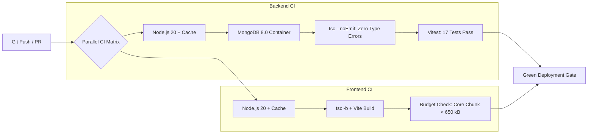

# GPMS 2.0 CI/CD Pipeline & Automated Quality Gates

## Executive Summary

Phase 12 established a zero-regression, automated **Continuous Integration (CI) Pipeline** using GitHub Actions ([`.github/workflows/ci.yml`](file:///.github/workflows/ci.yml)). The pipeline runs concurrently on every pull request and push to `main`, enforcing strict static typechecking, automated test execution, production bundling, and frontend performance budget compliance.

---

## 1. Pipeline Architecture & Workflow



---

## 2. Job Stages & Automated Quality Gates

### Job 1: `backend-ci`
1. **Container Service**: Boots an isolated `mongo:8.0` container on port 27017 with live `mongosh` health checking.
2. **TypeScript Compilation**: `npx tsc --noEmit` verifies 100% strict type safety across all controllers, services, and models.
3. **Automated Unit & Integration Testing**: Runs the complete Vitest test suite (`npm test`) validating authentication, RBAC, caching, and background jobs.

### Job 2: `frontend-ci`
1. **Production Build**: Executes `npm run build` (`tsc -b && vite build`), guaranteeing zero broken imports or invalid TS syntax.
2. **Bundle Budget Enforcement**: Audits generated chunks to ensure the main entry bundle strictly adheres to the `< 650 kB` performance budget threshold (currently **571.01 kB**).

---

## 3. Local Pipeline Reproduction

To test the entire pipeline locally prior to committing:
```bash
# Backend Verification
cd backend
npx tsc --noEmit
npm test

# Frontend Verification
cd ../client
npm run build
```
