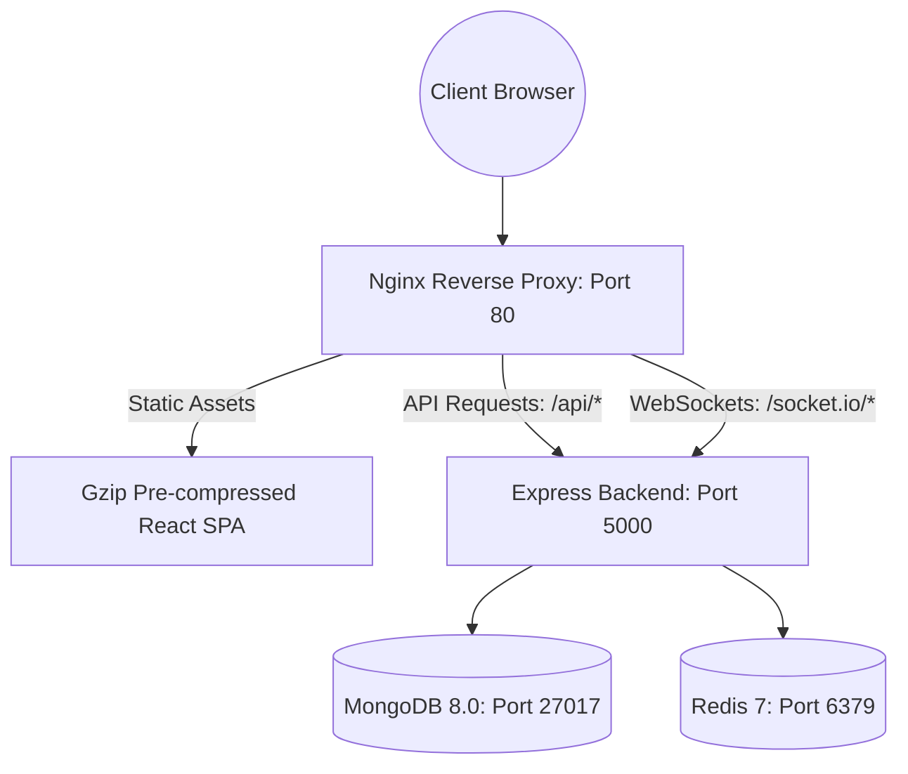

# GPMS 2.0 Production Deployment & Orchestration Guide

## Executive Summary

GPMS 2.0 is containerized using multi-stage Docker builds and Docker Compose, orchestrating the Node.js API, MongoDB 8.0, Redis 7, and Nginx reverse proxy with health checking and zero-downtime rolling restarts.

---

## 1. Production Architecture Overview



---

## 2. Health & Readiness Probes

Container orchestrators (Kubernetes, AWS ECS, Docker Swarm) monitor system health via two dedicated endpoints:

### Liveness Probe: `GET /health`
Verifies that the Node.js process is active and event loop is responsive.
* **Response**: HTTP 200
  ```json
  {
    "status": "ok",
    "uptime": 1420.5,
    "timestamp": "2026-09-09T20:38:50.086Z"
  }
  ```

### Readiness Probe: `GET /health/ready`
Verifies that database connections and cache stores are operational before routing client traffic.
* **Success Response**: HTTP 200
  ```json
  {
    "status": "ready",
    "database": "connected",
    "cache": {
      "mode": "redis",
      "hitRatio": "99.3%"
    },
    "uptime": 1420.5,
    "timestamp": "2026-09-09T20:38:50.580Z"
  }
  ```
* **Failure Response**: HTTP 503 `Service Unavailable`
  ```json
  {
    "status": "not_ready",
    "database": "disconnected",
    "timestamp": "2026-09-09T20:38:50.580Z"
  }
  ```

---

## 3. Deployment with Docker Compose

### Prerequisites
* Docker Engine 24+ & Docker Compose v2+

### One-Command Deployment
```bash
docker compose up -d --build
```

### Checking Container Health
```bash
docker compose ps
```
Both MongoDB and Redis verify health via native healthcheck commands (`mongosh ping` and `redis-cli ping`) before the backend starts listening for requests.
