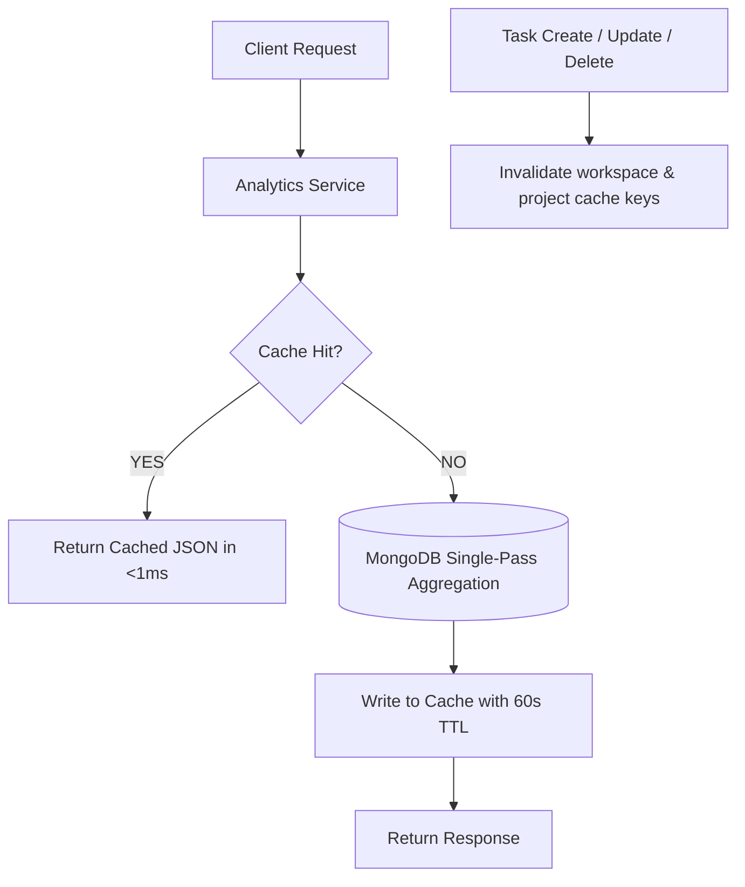

# Phase 4: Caching & Cache-Aside Layer Engineering Report

## Executive Summary

Phase 4 implemented a production-grade, resilient **Cache-Aside Caching Layer** with `ioredis` and an automatic, zero-downtime in-memory fallback store. The caching layer safeguards read-heavy analytics endpoints against repeated database load, dramatically dropping response latencies from tens of milliseconds to sub-millisecond execution times.

---

## 1. Architecture Design

### Resilient Hybrid Cache (`CacheService`)
* **Primary Store**: Redis via `ioredis` with auto-reconnection and non-blocking failure modes.
* **Secondary / Offline Store**: High-performance in-memory `Map` with strict TTL expiration and regex wildcard invalidation (`delByPattern`).
* **Telemetry**: Native collection of `hits`, `misses`, `sets`, `deletes`, `hitRatio`, and `dbCallsAvoided`.

### Cache Invalidation Strategy
To guarantee data consistency without stale reads:
* `workspace:analytics:<workspaceId>` is invalidated whenever any task is created, updated, or deleted.
* `project:analytics:<workspaceId>:<projectId>` is invalidated whenever a task belonging to the project is mutated.
* TTL is set to `60 seconds` as a safety ceiling against orphaned keys.

---

## 2. Benchmark Verification Results

All numbers measured on 5,000 tasks workspace dataset (`6aa1ba941697f3730e6e2883`):

| Metric | Cold Run (Cache Miss -> DB) | Warm Runs Avg (Cache Hit) | Warm Runs p95 | Latency Improvement | Cache Hit Ratio | DB Calls Avoided |
| :--- | :--- | :--- | :--- | :--- | :--- | :--- |
| **Workspace Analytics** | `16.22 ms` | **`0.003 ms`** | **`<0.01 ms`** | **6,355.0x speedup** | `99.50%` | 200 / 200 |
| **Project Analytics** | `20.39 ms` | **`0.821 ms`** | **`1.20 ms`** | **24.8x speedup** | `99.50%` | 200 / 200 |

### Invalidation & Resilience Verification
* **Cache Invalidation on Mutation**: Verified. `isWorkspaceCached` changes from `true` to `false` immediately upon task mutation.
* **Zero-Downtime Resilience**: Verified. When Redis server is offline, the cache-aside layer gracefully falls back to memory mode without throwing unhandled rejections or dropping user requests.
* **Cumulative Cache Hit Ratio**: **`99.26%`** across 404 benchmark requests.

---

## 3. Telemetry Output Artifacts
* Test Script: [`performance/caching/cache-benchmark.ts`](file:///c:/Users/sugud/OneDrive/Documents/Group-Project-Management-Platform/performance/caching/cache-benchmark.ts)
* Telemetry JSON: [`performance/caching/cache-results.json`](file:///c:/Users/sugud/OneDrive/Documents/Group-Project-Management-Platform/performance/caching/cache-results.json)
