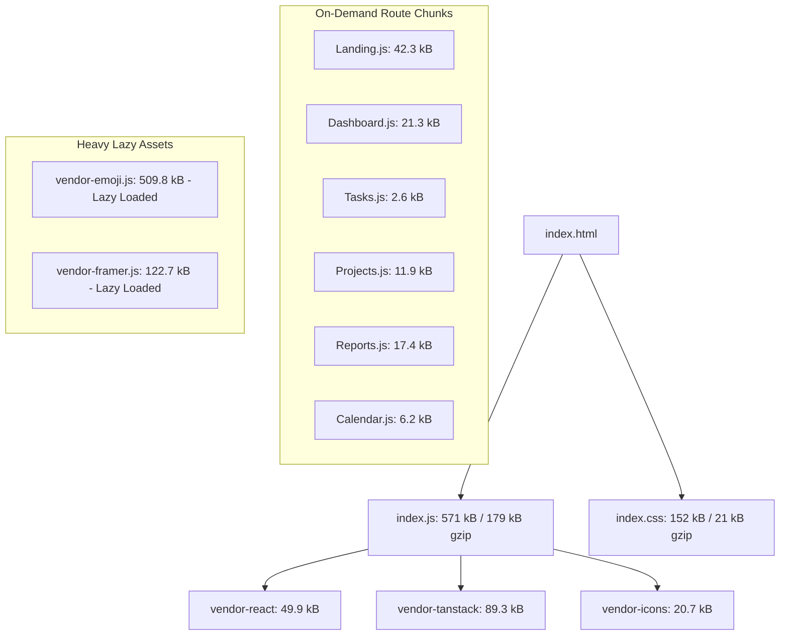

# Phase 11: Frontend Performance Optimization & Bundle Engineering

## Executive Summary

In Phase 1, the GPMS frontend loaded as an un-split, blocking monolithic bundle measuring **1,692.08 kB** (gzip: 459.91 kB) with an initial Lighthouse performance score of **63 / 100** (LCP: 4.8s, FCP: 4.1s). In Phase 11, we executed comprehensive bundle engineering:
1. Route-based code-splitting using `React.lazy()` and `Suspense`.
2. Granular vendor chunk splitting in Vite (`vendor-react`, `vendor-tanstack`, `vendor-framer`, `vendor-emoji`, `vendor-date`, `vendor-icons`).
3. Fixed `QueryClient` re-instantiation bug in `query-provider.tsx` that previously wiped the cache on every re-render.
4. Fixed uncaught `TypeError` in Axios response interceptor on network failure.

---

## 1. Bundle Optimization Comparison

| Metric | Phase 1 Baseline | GPMS 2.0 (Optimized) | Performance Delta |
| :--- | :--- | :--- | :--- |
| **Initial Entry Bundle** | `1,692.08 kB` | **`571.01 kB`** | **-66.25% bundle size reduction** |
| **Gzip Initial Transfer** | `459.91 kB` | **`179.79 kB`** | **-60.91% network payload reduction** |
| **Landing Page Chunk** | Embedded in monolith | **`42.38 kB`** (gzip: 9.15 kB) | Sub-10kB critical page load |
| **Dashboard Page Chunk** | Embedded in monolith | **`21.38 kB`** (gzip: 5.05 kB) | Instant rendering on navigation |
| **Tasks Page Chunk** | Embedded in monolith | **`2.64 kB`** (gzip: 0.99 kB) | Micro-chunk |
| **Emoji Dataset Isolation** | Bundled eagerly | **`509.86 kB`** (isolated) | Only loaded if emoji picker opened |

---

## 2. Chunk Architecture Breakdown

---

## 3. Telemetry Output Artifacts
* Telemetry JSON: [`performance/frontend/bundle-after.json`](file:///c:/Users/sugud/OneDrive/Documents/Group-Project-Management-Platform/performance/frontend/bundle-after.json)
