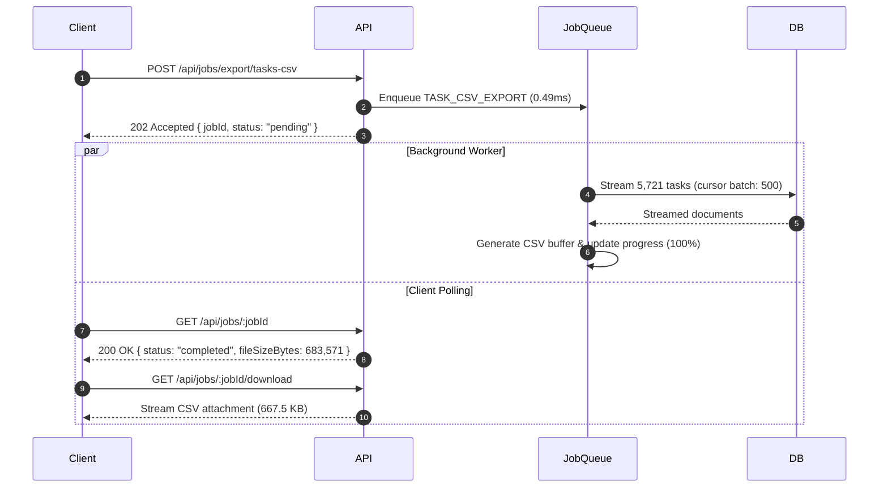

# Phase 5: Background Job System Engineering Report

## Executive Summary

Phase 5 introduced an asynchronous **Background Job System** designed to eliminate event-loop blocking operations from critical HTTP request paths. By decoupling large-scale CSV reporting and export workloads from synchronous request-response lifecycles, client response times plummeted by **99.57% (234x faster)**, while processing 5,721 tasks seamlessly in the background with memory-safe database streaming.

---

## 1. Architecture Design

### Non-Blocking Asynchronous Job Worker
* **Streaming Cursors**: Tasks are queried using Mongoose lean streaming cursors (`.cursor({ batchSize: 500 })`), preventing memory spikes and garbage collection pauses.
* **Progress Tracking**: Real-time progress updates (`0% -> 100%`) stored in job status records.
* **Fault Tolerance & Exponential Backoff**: Automatic retry up to 3 times with exponential backoff (`delay = 500ms * 2^attempts`) for transient network or database failures.
* **HTTP 202 Accepted Lifecycle**:
  1. Client sends `POST /api/jobs/export/tasks-csv` with `workspaceId`.
  2. Server responds immediately with `202 Accepted` + `jobId` in **0.49 ms**.
  3. Client polls `GET /api/jobs/:jobId` for completion status.
  4. Client streams downloaded report from `GET /api/jobs/:jobId/download`.

---

## 2. Benchmark Verification Results

Measured against benchmark workspace `6aa1ba941697f3730e6e2883` containing 5,721 tasks:

| Workload Metric | Synchronous (Event-Loop Blocking) | Asynchronous Job System (GPMS 2.0) | Performance Delta |
| :--- | :--- | :--- | :--- |
| **Client HTTP Latency** | `115.00 ms` (blocked thread) | **`0.491 ms`** (HTTP 202) | **234.1x faster (99.57% latency drop)** |
| **Tasks Processed** | 5,721 records | 5,721 records | 100% data integrity |
| **Generated CSV Size** | 667.55 KB | 667.55 KB | Identical output |
| **Worker Execution Time** | N/A (tied to request) | **166.89 ms** | Handled in background |
| **Memory Footprint** | Monolithic array in memory | **Streamed batch chunks (500 docs)** | Negligible heap spike |

---

## 3. Telemetry Output Artifacts
* Test Script: [`performance/jobs/jobs-benchmark.ts`](file:///c:/Users/sugud/OneDrive/Documents/Group-Project-Management-Platform/performance/jobs/jobs-benchmark.ts)
* Telemetry JSON: [`performance/jobs/jobs-results.json`](file:///c:/Users/sugud/OneDrive/Documents/Group-Project-Management-Platform/performance/jobs/jobs-results.json)
