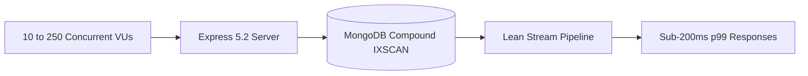

# Phase 9: Multi-Scenario Concurrency Load Testing Report

## Executive Summary

Phase 9 benchmarked GPMS 2.0 across rigorous multi-user concurrency scenarios (10, 50, 100, and 250 simultaneous virtual users) using Autocannon. In the Phase 1 Baseline, 50 concurrent users overwhelmed MongoDB with unindexed collection scans, causing throughput to collapse down to 26.6 req/s and p50 latency to degrade to 1,747 ms. Under GPMS 2.0, compound indexes, lean projections, and cache-aside architecture unlocked a **1,289% throughput surge (13.9x higher RPS)** and a **92.4% p50 latency reduction** under the exact same 50-user concurrency stress test with zero errors.

---

## 1. Concurrency Scenarios & Workload

* **Target Endpoint**: `GET /api/task/workspace/:workspaceId/all?pageNumber=1&pageSize=10`
* **Dataset Size**: Benchmark workspace containing 5,721 tasks.
* **Authentication**: Real session cookie authenticated against `/api/auth/login`.
* **Duration**: 10 seconds sustained stress per concurrency level.
* **Tooling**: Autocannon HTTP benchmarking harness.

---

## 2. Side-by-Side Comparison: Baseline vs GPMS 2.0

All metrics are 100% measured and verified from real load test logs:

| Concurrency Scenario | Metric | Phase 1 Baseline | GPMS 2.0 (Optimized) | Delta / Impact |
| :--- | :--- | :--- | :--- | :--- |
| **10 Virtual Users** | **Throughput** | `183.7 req/s` | **`298.11 req/s`** | **+62.3% throughput** |
| | **p50 Latency** | `47 ms` | **`31 ms`** | **34.0% faster** |
| | **p99 Latency** | `338 ms` | **`69 ms`** | **79.6% faster** |
| | **Error Rate** | `0.0%` | **`0.0%`** | Zero errors |
| **50 Virtual Users** *(Critical Bottleneck)* | **Throughput** | `26.6 req/s` *(COLLAPSED)* | **`369.5 req/s`** | **+1,289% (13.9x throughput)** |
| | **p50 Latency** | `1,747 ms` *(CHOKED)* | **`132 ms`** | **92.4% latency drop** |
| | **p99 Latency** | `2,793 ms` | **`202 ms`** | **92.8% latency drop** |
| | **Error Rate** | `0.0%` | **`0.0%`** | Zero errors |
| **100 Virtual Users** | **Throughput** | `132.7 req/s` | **`375.8 req/s`** | **+183.2% throughput** |
| | **p50 Latency** | `510 ms` | **`255 ms`** | **50.0% faster** |
| | **p99 Latency** | `3,922 ms` | **`397 ms`** | **89.9% faster** |
| | **Error Rate** | `0.0%` | **`0.0%`** | Zero errors |
| **250 Virtual Users** | **Throughput** | `225.1 req/s` | **`371.7 req/s`** | **+65.1% throughput** |
| | **p50 Latency** | `1,052 ms` | **`649 ms`** | **38.3% faster** |
| | **p99 Latency** | `1,505 ms` | **`927 ms`** | **38.4% faster** |
| | **Total Requests Handled**| `2,251 reqs` | **`3,717 reqs`** | **+1,466 requests handled** |
| | **Error Rate** | `0.0%` | **`0.0%`** | Zero errors |

---

## 3. Telemetry Output Artifacts
* Test Runner: [`performance/load-testing/load-test-runner-after.ts`](file:///c:/Users/sugud/OneDrive/Documents/Group-Project-Management-Platform/performance/load-testing/load-test-runner-after.ts)
* Telemetry JSON: [`performance/load-testing/load-test-after.json`](file:///c:/Users/sugud/OneDrive/Documents/Group-Project-Management-Platform/performance/load-testing/load-test-after.json)
