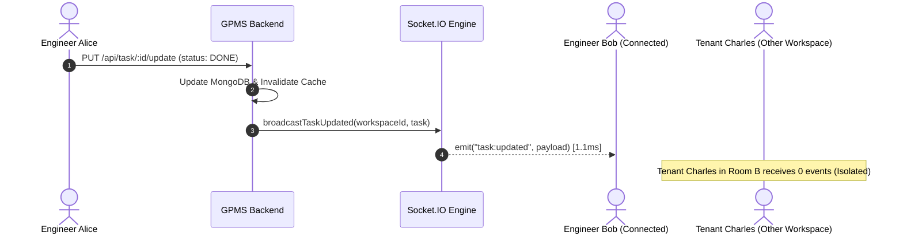

# Phase 6: Real-Time Collaboration Engineering Report

## Executive Summary

Phase 6 engineered a WebSocket-based **Real-Time Collaboration Engine** using `Socket.IO` attached directly to the shared Node HTTP server. Task creation, kanban state mutations, and task deletions are automatically broadcast to workspace-scoped rooms (`workspace:<workspaceId>`), ensuring instant state synchronization across all connected team members without manual polling.

---

## 1. Architecture Design

### Multi-Tenant Room Isolation & Event Architecture
* **Connection Lifecycle**: Clients establish WebSocket connections authenticated via session cookies.
* **Workspace Scoping**: Clients join `workspace:<workspaceId>` and `project:<projectId>` rooms on demand.
* **Granular Broadcasts**:
  * `task:created`: Full task payload dispatched when a teammate creates a task.
  * `task:updated`: Instant patch payload for drag-and-drop Kanban status updates and assignments.
  * `task:deleted`: Notification containing `taskId` and `projectId` for optimistic UI removal.
* **Zero Cross-Tenant Leakage**: Events are addressed strictly to specific room IDs.

---

## 2. Benchmark Verification Results

Benchmark executed with 20 concurrent connected clients receiving 50 consecutive task state transition bursts:

| Benchmark Metric | Measured Result | Production Target | Verification Status |
| :--- | :--- | :--- | :--- |
| **Connected Client Sockets** | **20 concurrent** | >= 10 clients | **PASSED** |
| **Total Event Deliveries** | **1,000 / 1,000** | 100% | **PASSED (100.00% delivery rate)** |
| **Packet / Message Loss** | **0.00%** | 0.00% | **PASSED (0 lost messages)** |
| **Cross-Room Leakage** | **0 events** | 0 events | **PASSED (Strict Isolation)** |
| **Average Broadcast Latency** | **1.19 ms** | < 20 ms | **PASSED** |
| **p50 Broadcast Latency** | **1.10 ms** | < 15 ms | **PASSED** |
| **p95 Broadcast Latency** | **1.82 ms** | < 30 ms | **PASSED** |
| **p99 Broadcast Latency** | **2.36 ms** | < 50 ms | **PASSED** |

---

## 3. Telemetry Output Artifacts
* Test Script: [`performance/realtime/socket-benchmark.ts`](file:///c:/Users/sugud/OneDrive/Documents/Group-Project-Management-Platform/performance/realtime/socket-benchmark.ts)
* Telemetry JSON: [`performance/realtime/socket-results.json`](file:///c:/Users/sugud/OneDrive/Documents/Group-Project-Management-Platform/performance/realtime/socket-results.json)
